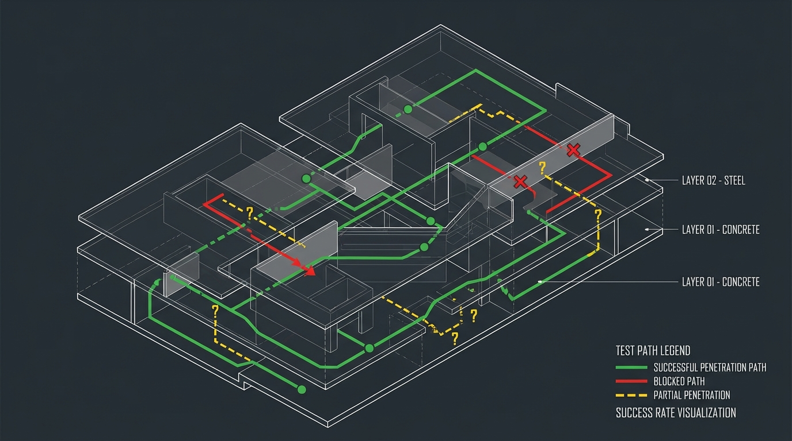

# Deadend CLI

[](https://discord.gg/zwUVa3E7KT)

**Autonomous pentesting agent using feedback-driven iteration**
Achieves ~78% on XBOW benchmarks with fully local execution and model-agnostic architecture.


*Like the project or want to know more? Feel free to [reach out](#contact)!*

> [!WARNING]
> **Active Development**: This project is undergoing active development. Core features are stable and production-ready, but we're continuously improving the interface, workflows, and adding new capabilities based on user feedback. Check out the [roadmap](#current-status--roadmap) or open a issue for a future issue. 

> [!NOTE]
> For discussions, research, and feature ideas, join the community Discord: [Deadend CLI Discord](https://discord.gg/zwUVa3E7KT).


📄 [Read Technical Deep Dive](https://xoxruns.medium.com/feedback-driven-iteration-and-fully-local-webapp-pentesting-ai-agent-achieving-78-on-xbow-199ef719bf01) | 📊 [Benchmark Results (use VScode ANSI colors to view)](https://github.com/xoxruns/deadend-cli/tree/main/benchmarks-results/xbow)

## Table of Contents

- [What is Deadend CLI?](#what-is-deadend-cli)
- [Architecture Summary](#architecture-summary)
- [Benchmark Results](#benchmark-results)
- [Core Analysis Capabilities](#core-analysis-capabilities)
- [Models tested until now](#models-tested-until-now)
- [Custom Pentesting Tools](#-custom-pentesting-tools)
- [Quick Start](#quick-start)
  - [Prerequisites](#prerequisites)
  - [Installation](#installation)
  - [First Run](#first-run)
  - [Development](#development)
- [Usage Examples](#usage-examples)
- [Commands](#commands)
- [Model Settings and Configuration](#model-settings-and-configuration)
- [Technology Stack](#technology-stack)
- [Current Status & Roadmap](#current-status--roadmap)
- [Contributing](#contributing)
- [Citation](#citation)
- [Contact](#contact)

---

## What is Deadend CLI?

Deadend CLI is an autonomous web application penetration testing agent that uses feedback-driven iteration to adapt exploitation strategies. When standard tools fail, it generates custom Python payloads, observes responses, and iteratively refines its approach until breakthrough.

**Key features:**
- Fully local execution (no cloud dependencies, zero data exfiltration)
- Model-agnostic design (works with any deployable LLM)
- Custom sandboxed tools (Playwright, Docker, WebAssembly)
- ADaPT-based architecture with supervisor-subagent hierarchy
- Confidence-based decision making (fail <20%, expand 20-60%, refine 60-80%, validate >80%)

**Benchmark results:** 78% on XBOW validation suite (76/98 challenges), including blind SQL injection exploits where other agents achieved 0%.

[Read the architecture breakdown in our technical article →](https://xoxruns.medium.com/feedback-driven-iteration-and-fully-local-webapp-pentesting-ai-agent-achieving-78-on-xbow-199ef719bf01)

## Architecture Summary

The agent uses a two-phase approach (reconnaissance → exploitation) with a supervisor-subagent hierarchy:

**Supervisor**: Maintains high-level goals, delegates to specialized subagents
**Subagents**: Focused toolsets (Requester for HTTP, Shell for commands, Python for payloads)
**Policy**: Confidence scores (0-1.0) determine whether to fail, expand, refine, or validate

**Key innovation:** When standard tools fail, the agent generates custom exploitation scripts and iterates based on observed feedback—solving challenges like blind SQL injection where static toolchains achieve 0%.

[Read full architecture details →](https://xoxruns.medium.com/feedback-driven-iteration-and-fully-local-webapp-pentesting-ai-agent-achieving-78-on-xbow-199ef719bf01)


## Benchmark Results

> **Note**: To visualize the benchmark results properly, install an ANSI colors extension (e.g., [ANSI Colors](https://marketplace.visualstudio.com/items?itemName=iliazeus.vscode-ansi) for VS Code) to render the rich output.

Evaluated on XBOW's 104-challenge validation suite (black-box mode, January 2026):

| Agent | Success Rate | Infrastructure | Blind SQLi |
|-------|-------------|----------------|------------|
| XBOW (proprietary) | 85% | Proprietary | ? |
| Cyber-AutoAgent | 85% (This is the latest Cyber-Autoagent scoring for october 2025) <s>81%</s>| AWS Bedrock | 0% |
| **Deadend CLI** | **78%** | **Fully local** | **33%** |
| MAPTA | 76.9% | External APIs | 0% |

**Models tested:** Claude Sonnet 4.5 (~78%), Kimi K2 Thinking (~69%)

Strong performance: XSS (91%), Business Logic (86%), SQL injection (83%), IDOR (80%)
Perfect scores: GraphQL, SSRF, NoSQL injection, HTTP method tampering (100%)

## Core Analysis Capabilities

The framework focuses on **intelligent security analysis** through:

- **🔍 Taint Analysis**: Automated tracking of data flow from sources to sinks
- **🎯 Source/Sink Detection**: Intelligent identification of entry points and vulnerable functions
- **🔗 Contextual Tool Integration**: Smart connection to specialized tools for testing complex logic patterns
- **🧠 AI-Driven Reasoning**: Context-aware analysis that mimics expert security thinking

## Models tested until now

The following models have been tested with Deadend CLI. Compatibility and performance may vary:

**Moonshot AI**
- **Models**: `Kimi-K2-Thinking`, `Kimi-K2.5`
- **Status**: Works excellently across all features
- **Notes**: Reliable performance at every step of the workflow

**Anthropic**
- **Models**: Claude Sonnet 4.5, Claude 3 Opus, Claude 3 Haiku
- **Status**: Powerful models with excellent results
- **Notes**: Properly extracts results and token usage information. Recommended for production use.

**DeepSeek**
- **Models**: DeepSeek models via various providers
- **Status**: Functional but with limitations
- **Notes**: Models work for general reasoning but struggle with shell command execution and HTTP payload generation. May require architecture adjustments or model fine-tuning for optimal performance.

**OpenAI**
- **Models**: GPT-5.X, Codex variants
- **Status**: Under investigation
- **Notes**: Some issues observed with tool execution via LiteLLM. Requires further investigation before definitive compatibility assessment.

> **Tip**: For best results, we recommend using Moonshot AI (Kimi models) or Anthropic (Claude) models, which have been thoroughly tested and show excellent compatibility with all Deadend CLI features.

## 🔧 Custom Pentesting Tools

- **Webapp-Specific Tooling**: Custom tools designed specifically for web application penetration testing
- **Authentication Handling**: Built-in support for session management, cookies, and auth flows
- **Fine-Grained Testing**: Precise control over individual requests and parameters
- **Payload Generation**: AI-powered payload creation tailored to target context
- **Automated Payload Testing**: Generate, inject, and validate payloads in a single workflow

---

## Quick Start

### Prerequisites
- Docker (required)
- curl (for installation script)

### Installation

**Recommended: Install from release (Linux x86_64 / macOS ARM64)**

```bash
# Install latest release
curl -fsSL https://raw.githubusercontent.com/xoxruns/deadend-cli/main/install.sh | bash

# Or install a specific version
curl -fsSL https://raw.githubusercontent.com/xoxruns/deadend-cli/main/install.sh | bash -s -- --version v1.0.0

# Custom installation directory (default: ~/.cache/server)
curl -fsSL https://raw.githubusercontent.com/xoxruns/deadend-cli/main/install.sh | bash -s -- --install-dir /path/to/install
```

The installer will:
- Download pre-built binaries for your platform
- Install the RPC server to `~/.cache/server` (or custom directory)
- Install the CLI binary to `~/.local/bin` (or `/usr/local/bin` on macOS)
- Set up Playwright browsers automatically

### First Run

In the first run we will be greeted with a presetup view to initialize the model you want to use and 

# Start the cli
```bash
deadend  --target "http://localhost:3000" --prompt "find SQL injection vulnerabilities"
```

**Note:** If `deadend` is not found, ensure the installation directory is in your PATH:
- Linux: `~/.local/bin`
- macOS: `/usr/local/bin`

```bash
# Linux
export PATH="$HOME/.local/bin:$PATH"
# macOS
export PATH="/usr/local/bin:$PATH"
# Add to ~/.bashrc or ~/.zshrc to make it permanent
```

### Development

**Build from source**

```bash
git clone https://github.com/xoxruns/deadend-cli.git
cd deadend-cli
uv sync
```

**Run CLI with Deno**

To run the CLI interface directly with Deno for development:

```bash
cd cli/deadend_cli
deno task dev
```

---

## Usage Examples

### Basic Vulnerability Testing
```bash
# Test OWASP Juice Shop
docker run -p 3000:3000 bkimminich/juice-shop

deadend --target http://localhost:3000 --prompt "test the login endpoint for SQL injection"
```

### API Security Testing
```bash
deadend --target https://api.example.com --prompt "test authentication for broken access control"
```

---

## Commands

### `deadend`
Start interactive security testing session
- `--target`, `-t`: Target URL
- `--prompt`, `-p`: Initial testing prompt
- `--mode`, `-m`: `hacker` (approval required) or `yolo` (autonomous)
- `--codebase`, `-c`: Codebase destination folder (⚠️ **Coming soon** - not implemented yet)

---

## Model Settings and Configuration

The configuration file containing model specifications and API keys is located at `~/.cache/deadend/config.json`. This file handles both text generation models (for agent reasoning) and text embedding models (for RAG/vector search).

### Configuration File Location

- **Path**: `~/.cache/deadend/config.json`
- **Format**: JSON
- **Initial Setup**: The presetup wizard will guide you through initial configuration on first run

### Model Schema

When defining a model, use the following schema. The key format `<provider>:<model_name>` follows [LiteLLM's naming convention](https://docs.litellm.ai/docs/providers):

```json
"<provider>:<model_name>": {
  "provider": "<provider>",        // Provider name (e.g., openai, anthropic, ollama)
  "model_name": "<model_name>",    // Model identifier (e.g., claude-sonnet-4-5, gpt-4)
  "api_key": "<api_key>",          // API key (optional if ENV var is set, but recommended to add here)
  "base_url": "<base_url>",        // Base URL for custom gateways or providers (e.g., Ollama)
  "type_model": null,              // Set to "embeddings" only for embedding models
  "vec_dim": null                  // Vector dimension for embedding models (defaults to 1536)
}
```

**Key Format**: The JSON key must be in the format `<provider>:<model_name>` where:
- `<provider>` matches the LiteLLM provider identifier (see [supported providers](https://docs.litellm.ai/docs/providers))
- `<model_name>` is the specific model identifier for that provider

### Example Configuration

Here's an example `config.json` with both a text generation model and an embedding model:

```json
{
  "anthropic:claude-sonnet-4-5": {
    "provider": "anthropic",
    "model_name": "claude-sonnet-4-5",
    "api_key": "sk-ant-api03-...",
    "base_url": null,
    "type_model": null,
    "vec_dim": null
  },
  "openrouter:qwen/qwen3-embedding-8b": {
    "provider": "openrouter",
    "model_name": "qwen/qwen3-embedding-8b",
    "api_key": "sk-or-v1-...",
    "base_url": "https://openrouter.ai/api/v1/embeddings",
    "type_model": "embeddings",
    "vec_dim": 4096
  }
}
```

### Model Types

**Text Generation Models** (`type_model: null`):
- Used for agent reasoning, task planning, and payload generation
- Examples: Claude Sonnet 4.5, GPT-4, Llama 3, etc.
- Required for core agent functionality

**Embedding Models** (`type_model: "embeddings"`):
- Used for RAG (Retrieval-Augmented Generation) and vector search
- Requires `vec_dim` to specify vector space dimension
- Optional but recommended for better context retrieval

### Adding Models

1. **Via Presetup Wizard** (Recommended): Run `deadend` without configuration to launch the interactive setup
2. **Manual Configuration**: Edit `~/.cache/deadend/config.json` directly using the schema above
3. **Environment Variables**: API keys can be set via environment variables, but storing them in `config.json` is recommended for convenience

### Supported Providers

Deadend CLI uses [LiteLLM](https://docs.litellm.ai/) for model abstraction, which provides a unified interface to multiple LLM providers. Models follow LiteLLM's naming convention: `provider:model_name`.

#### Model Format

Models are specified using the format `<provider>:<model_name>` in both `config.json` and `settings.json`. The provider name corresponds to the LiteLLM provider identifier.

**Examples:**
- `anthropic:claude-sonnet-4-5` - Anthropic's Claude Sonnet 4.5
- `openai:gpt-4` - OpenAI's GPT-4
- `openrouter:qwen/qwen3-embedding-8b` - Qwen embedding model via OpenRouter
- `ollama:llama3` - Llama 3 via local Ollama instance

#### Supported Providers

Deadend CLI supports all providers compatible with LiteLLM. For a complete list of supported providers and their model names, see the [LiteLLM Providers Documentation](https://docs.litellm.ai/docs/providers).

**Popular providers include:**
- **OpenAI**: `openai:gpt-4`, `openai:gpt-3.5-turbo`, `openai:gpt-4o`, etc.
- **Anthropic**: `anthropic:claude-3-opus`, `anthropic:claude-sonnet-4-5`, `anthropic:claude-3-haiku`, etc.
- **Ollama**: `ollama:llama3`, `ollama:mistral`, `ollama:codellama`, etc. (requires `base_url` in config)
- **OpenRouter**: `openrouter:meta-llama/llama-3-70b-instruct`, `openrouter:google/gemini-pro`, etc.
- **HuggingFace**: `huggingface/meta-llama/Llama-2-7b-chat-hf` (requires `base_url`)

**For embedding models**, use the same format and set `type_model: "embeddings"` in `config.json`:
- `openai:text-embedding-ada-002`
- `openrouter:qwen/qwen3-embedding-8b`
- `ollama:nomic-embed-text`

> **Note**: Some providers may require additional configuration such as `base_url` or specific API key formats. Refer to the [LiteLLM Provider Documentation](https://docs.litellm.ai/docs/providers) for provider-specific setup instructions.

### CLI Interface Settings (`settings.json`)

The CLI interface uses a separate `settings.json` file located at `~/.cache/deadend/settings.json` to store default preferences and UI settings. This file contains:

- **Default model selection**: Which provider and model to use by default
- **Execution mode**: Default execution mode (yolo or supervisor)
- **UI preferences**: Component status display and auto-collapse settings
- **Last target**: Remembers the last target URL used
- **Embedding model**: Default embedding model for RAG operations

#### Settings Schema

```json
{
  "provider": "anthropic",                    // Default LLM provider
  "model": "claude-sonnet-4-5",              // Default model name
  "executionMode": "yolo",                   // Default execution mode: "yolo" or "supervisor"
  "showComponentStatus": true,                // Show component health status in UI
  "autoCollapseStatus": false,                // Auto-collapse status messages
  "lastTarget": "",                          // Last target URL used
  "embedding": {                              // Default embedding model configuration
    "provider": "openrouter",
    "model": "qwen/qwen3-embedding-8b"
  }
}
```

#### Settings File Location

- **Path**: `~/.cache/deadend/settings.json`
- **Format**: JSON
- **Auto-created**: Created automatically when you configure models via the presetup wizard
- **Separate from config.json**: This file stores CLI preferences, while `config.json` stores model API keys and specifications

#### Key Differences

| File | Purpose | Contains |
|------|---------|----------|
| `config.json` | Model specifications | API keys, model definitions, base URLs, vector dimensions |
| `settings.json` | CLI preferences | Default model selection, execution mode, UI settings, embedding defaults |

The CLI interface reads from `settings.json` to determine which model to use by default, while `config.json` provides the actual API keys and connection details for those models.


---

## Technology Stack

**Backend/Agent:**
- **LiteLLM**: Multi-provider model abstraction (OpenAI, Anthropic, Ollama)
- **Instructor**: Structured LLM outputs
- **pgvector**: Vector database for context
- **Pyodide/WebAssembly**: Python sandbox
- **Playwright**: HTTP request generation (bundled with browser binaries)
- **Docker**: Shell command isolation
- **PyOxidizer**: Standalone binary packaging

**CLI Interface:**
- **Deno**: Runtime environment for the CLI
- **React**: UI framework (v19)
- **Ink**: React-based terminal UI framework
- **TypeScript/TSX**: Type-safe development
- **Commander**: CLI argument parsing
- **Marked**: Markdown parsing and rendering
- **marked-terminal**: Terminal markdown display

---

## Current Status & Roadmap

### Stable (v0.1.0)
- ✅ New architecture
- ✅ XBOW benchmark evaluation (78%)
- ✅ Custom sandboxed tools
- ✅ Multi-model support with liteLLM
- ✅ Two-phase execution (recon + exploitation)
- ✅ **CLI Redesign** with React/Ink interface
- ✅ Interactive chat interface with command system
- ✅ Supervisor and YOLO execution modes
- ✅ Real-time event streaming and component health monitoring
- ✅ Presetup wizard for configuration

### In Progress
- 🚧 Codebase analysis support (white-box testing)
- 🚧 Preset configuration workflows (API testing, web apps, auth bypass)
- 🚧 Workflow automation (save/replay attack chains)
- 🚧 Context optimization (reduce redundant tool calls)
- 🚧 Secrets management improvements
- 🚧 Report generation with templating (`/report`)
- 🚧 Plan mode (review strategies before execution via `/plan`)


### Future roadmap
The current architecture proves competitive autonomous pentesting (78%) is achievable without cloud dependencies. Next challenges:

- **Open-Source Models**: Achieve 75%+ with Llama/Qwen (eliminate proprietary dependencies)
- **Hybrid Testing**: Add AST analysis for white-box code inspection
- **Adversarial Robustness**: Train against WAFs, rate limiting, adaptive defenses
- **Multi-Target Orchestration**: Test interconnected systems simultaneously
- **Context Efficiency**: Better information sharing between components

Goal: Make autonomous pentesting accessible (open models), comprehensive (hybrid testing), and robust (works against real defenses).

---

## Contributing

Contributions welcome in:
- Context optimization algorithms
- Vulnerability test cases
- Open-weight model fine-tuning
- Adversarial testing scenarios

See [CONTRIBUTING.md](CONTRIBUTING.md) for guidelines on how to contribute.

---

## Citation
```bibtex
@software{deadend_cli_2026,
  author = {Yassine Bargach},
  title = {Deadend CLI: Feedback-Driven Autonomous Pentesting},
  year = {2026},
  url = {https://github.com/xoxruns/deadend-cli}
}
```

---

## Disclaimer

**For authorized security testing only.** Unauthorized testing is illegal. Users are responsible for compliance with all applicable laws and obtaining proper authorization.

---

## Contact

Have questions, feedback, or want to collaborate?

- 📧 **Email**: [yassine@straylabs.ai](mailto:yassine@straylabs.ai)
- 💬 **Discord**: xoxruns
- 🧪 **Discord Server**: [Join the Deadend community](https://discord.gg/zwUVa3E7KT) — use this space for discussions, research, and feature requests.
- 💼 **LinkedIn**: [Yassine Bargach](https://www.linkedin.com/in/yass-99637a105/)
- 🐦 **Twitter**: [@xoxruns](https://x.com/xoxruns)

---

## Links

📄 [Architecture Deep Dive](https://xoxruns.medium.com/feedback-driven-iteration-and-fully-local-webapp-pentesting-ai-agent-achieving-78-on-xbow-199ef719bf01)
📊 [Benchmark Results](https://github.com/xoxruns/deadend-cli/tree/main/benchmarks-results/xbow)
🐛 [Report Issues](https://github.com/xoxruns/deadend-cli/issues)
⭐ [Star this repo](https://github.com/xoxruns/deadend-cli)


